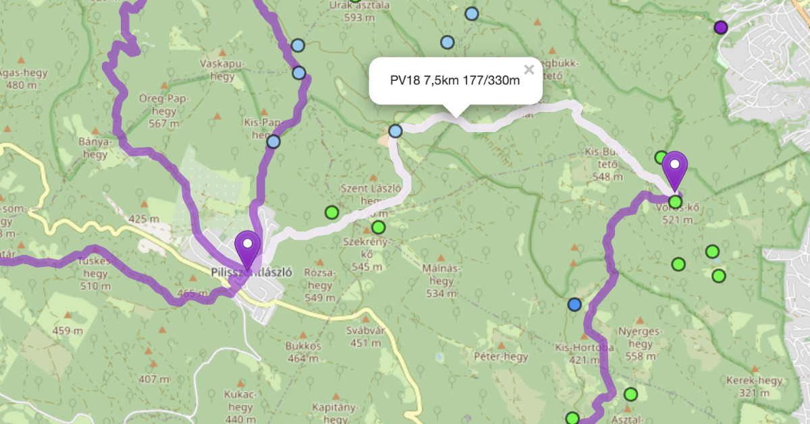

# 🇺🇸 geomap-add-gpx

## Intro 

[geocaching.hu](https://geocaching.hu) is the Hungarian geocaching website with a different (albeit overlapping) set of geocaches than [geocaching.com](https://geocaching.com). 

Their [GeoMap interface](https://geocaching.hu/geomap/) is a handy tool to get a quick map-based overview of geocaches hosted on the website, however, one might want to display a GPX file with its tracks and waypoints in addition to the geocaches that come from the server. This is what this bookmarklet does.

*Result of using the bookmarklet: a local GPX file displayed on the map along with the geocaches.*

## Usage

1. Save the following address to your bookmarks bar: `javascript:(function(){document.getElementsByTagName('head')[0].appendChild(document.createElement('script')).src='https://cdn.jsdelivr.net/gh/andrashann/geomap-add-gpx@main/bookmarklet.min.js';}());`
1. Go to [GeoMap](https://geocaching.hu/geomap/), wait for everything to load, then click the bookmarklet.
1. Select the GPX file you want to display.
1. Type the name of the color that you want to use to display the data.
1. Enjoy your data on the map.

PS: check out the sister project [geomap-add-lines](https://github.com/andrashann/geomap-add-lines), which connects the points of multi-caches on the map.

# 🇭🇺 geomap-add-lines

## Bevezető 

A [GeoMap](https://geocaching.hu/geomap/) a [geocaching.hu](https://geocaching.hu) térképes felülete. Időnként praktikus lenne a geoládák mellet térképen megjeleníteni egy GPX fájlt is, amiben saját trackek és pontok találhatók. Pontosan ezt teszi lehetővé ez a bookmarklet.

*A bookmarklet használatának eredménye: a geoládák mellett a lokális GPX file tartalma is megjelenik a térképen.*

## Használat

1. Mentsd el az alábbi hivatkozást a könyvjelzőid közé: `javascript:(function(){document.getElementsByTagName('head')[0].appendChild(document.createElement('script')).src='https://cdn.jsdelivr.net/gh/andrashann/geomap-add-gpx@main/bookmarklet.min.js';}());`
1. Menj a [GeoMapre](https://geocaching.hu/geomap/) és bökj az új könyvjelzőre (bookmarkletre)!
1. Válaszd ki a megjelenítendő GPX filet!
2. Írd be annak a színnek a nevét, amit a fájl megjelenítéséhez szeretnél használni.
3. Élvezd a térképen megjelenített adataidat.

UI: nézd meg a szorosan kapcslódó testvérprojektet is: [geomap-add-lines](https://github.com/andrashann/geomap-add-lines), ami a multiládák pontjait köti össze a térképen.